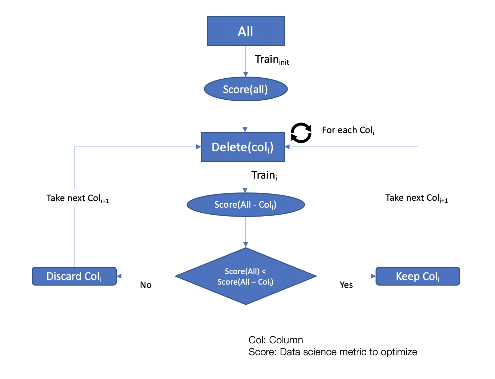
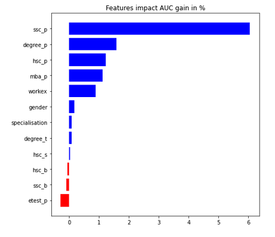

# Data science Asset for Feature selection in machine learning


This asset has been developed in order to help data scientists test their features. It is recommanded to use this asset toward the end of an experimentation, to reduce the number of features used in a machine learning model without loosing efficency. This framework is compatible with any machine learning technique that uses tabular data. 

The output of this model is the **minimum features** `k <= n` that can achieve **at least the same score** as the original model `new_score >= original_score`. 

Where:

-  `n` is the total number of features
-  `k` number of features returned by the library
-  `original_score` is the score achieved with `n` features
-  `new_score` is the score achieved with `k` features



# Getting started

## Install package 

Clone the package in you local repository:

```
git clone git@github.ibm.com:m-tantaoui/MLFeatureSelection.git
```

1. **Install using poetry (recommanded)**

	To use the package just make sure it is referenced in your PYTHONPATH. You can otherwise build the project with poetry and install it from the wheel file.
	
	```shell
	cd MLFeatureSelection/
	pip install poetry
	poetry build
	pip install ./dist/mlfeatureselection-1.0.0-py3-none-any.whl
	```

2. **Install using pip**

	```
	cd MLFeatureSelection/
	pip install -e .
	```


## Using the package 


1. Create a class that inherits from `FeatureSelection` module like the following:

	```python
	from feature_selection.selectors import FeatureSelector 
	
	class YourCustomClass(FeatureSelector):
	
		# Here implement one function: build_model
	
		def __init__(self, df, target_col, log_level, custom_cv=None):
			# here you can control the log_level : INFO, DEBUG, ERROR
			# df is the input dataframe
			# target_col is the name of the target column
			# custom_cv: you can provide a crossvalidation instance (ex: stratifiedKfold) 
			
	
		def build_model(self, args):
			# Define your model here: hyperparameters, classifier/regressor type, etc...
			# return a classifier that, in preference is compatible with Sklearn API
			# It is mandatory that the model returned implements the func "fit"
			
			return model
	```

2. After you created the class you can then use `feature_selection_cv` to run feature selection process: 

	**Example:**
	
	```python
	import pandas as pd
	
	path = "PATH_TO_MY_CSV"
	df = pd.read_csv(path)
	
	ml_selector = YourCustomClass(df, target_col=YOUR_TARGET_COL)
	list_kept_features, features_impact = ml_selector.feature_selection_cv(small_is_better=False,
														 scoring_metric='roc_auc',
														 cv=20,
														 fast_version=True,
														 nb_ft=13)
	```


	**List of parameters:**
	
	
	| Parameter        | Type           | Explanation  |
	| ---------------- |:--------------:| -----------------------------------------------------------------------------------|
	| small\_is\_better  | Boolean 		   | Is you wish to maximize `scoring_metric` then the value should be `False`, default : `True`.|
	| scoring_metric   | String         | Use one of sklearn native scoring metrics [here](https://scikit-learn.org/stable/modules/model_evaluation.html#the-scoring-parameter-defining-model-evaluation-rules) |
	| cv               | integer        | Number of folds for crossvalidation. |
	| fast_version     | Boolean        | **Only available for Xgboost**, if you wish to speed up the process set this parameter to `True`. |
	| nb_ft            | integer        | Number of features to select in the Train_init, will be considered only if `fast_version=True` |
	| tolerance        | float          | Tolerance is used to determine whether a feature is important by the impact it has on scoring metric with +/- tolerance |


3. **Analyse your features impact** on the performance

	The library also offers the possibility to analyse the impact of features by using the difference in performance with/without the feautre. This could be usefull in case of linear models like LogisticRegression or SVM, or Neural Network that doesn't have feature importance plots. 
	
	```python
	import matplotlib.pyplot as plt
	import pandas as pd
	%matplotlib inline
		
	ft_impact = pd.DataFrame(features_impact).sort_values('roc_auc gain', ascending=True)
	_ = plt.figure(figsize=(7,7))
	plt.barh(ft_impact.feature, ft_impact['roc_auc gain']*100, color=(ft_impact['roc_auc gain']>0).map({True: 'b', False: 'r'}))
	plt.title("Features impact: AUC gain in %")
	plt.show()
	```



## Practical examples

A practical example is available here: [link to notebook](notebooks/TestAsset.ipynb) shows how works:

- Feature selection with any model.
- Feature selection with Xgboost using `fast_version`.
- Feature selection with sklearn pipelines.
- Example using custom cross validation
